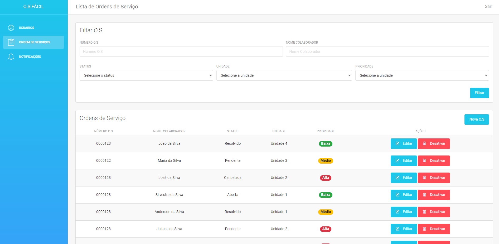
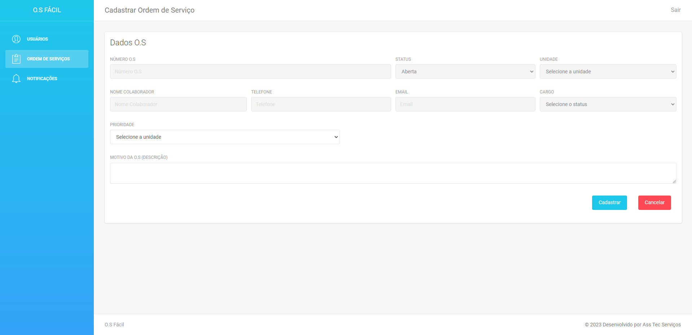
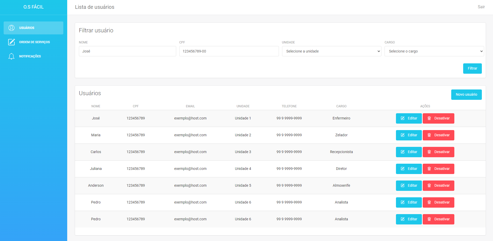
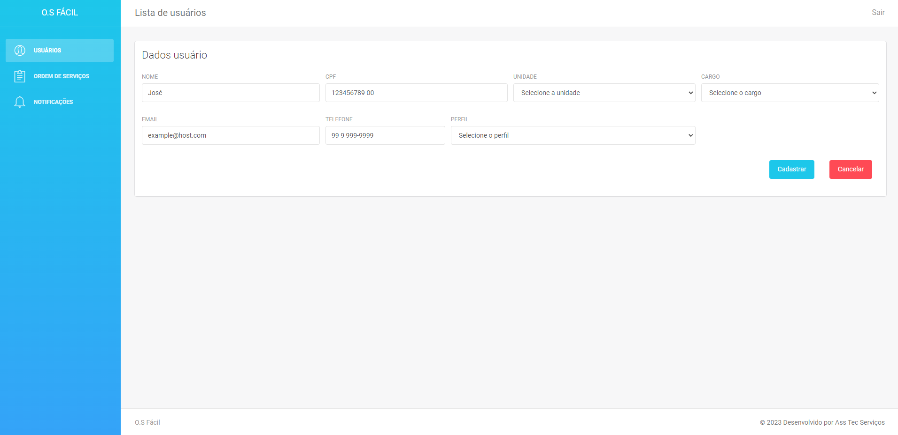
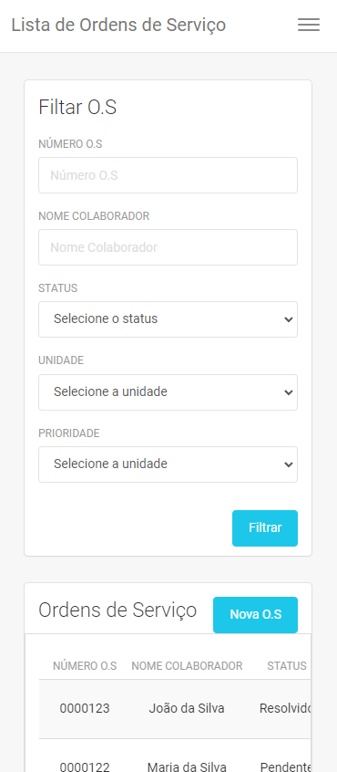
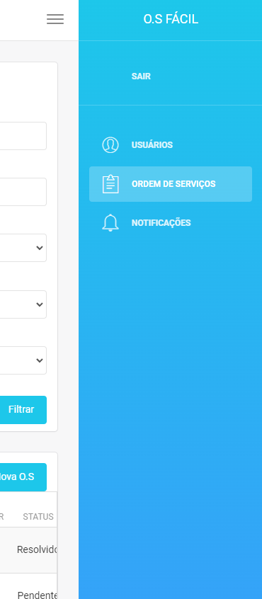

# o.s-facil
Sistema para gerenciamento de O.S

O objetivo da aplicação é otimizar e organizar o fluxo de ordem de serviços geradas dentro de um ambiente corporativo. 

## Preview 

	

	

	

	

	

	

	

## Autor 
Anderson Silva

## Deploy 
https://o-s-facil.vercel.app/
